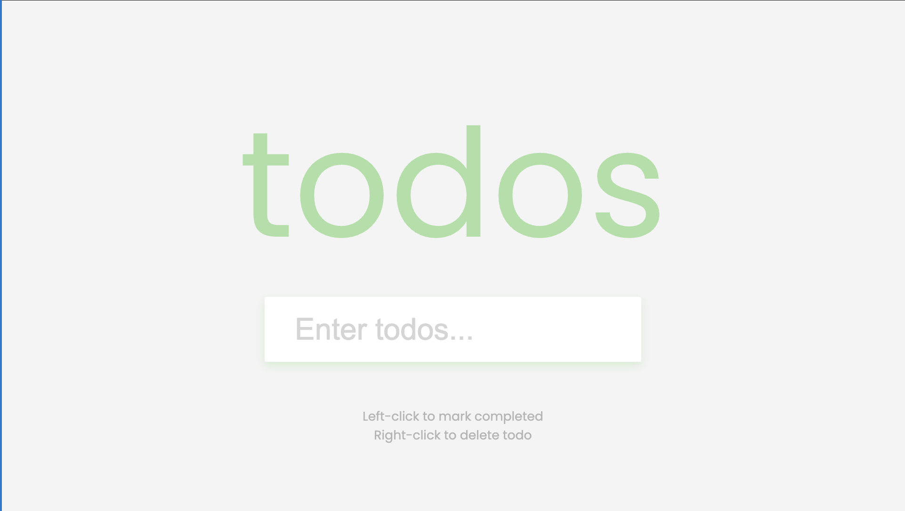

# Todo App



A simple yet powerful Todo App built with HTML, CSS, and JavaScript. This application allows users to efficiently manage their tasks by adding, completing, or deleting todos. With persistent storage via `localStorage`, the app ensures that your tasks are saved even after refreshing the page or closing the browser.

## Key Features
- **Add Todos**: Quickly add new tasks to your todo list.
- **Mark as Completed**: Left-click on a task to mark it as completed, with a strikethrough for visual feedback.
- **Delete Todos**: Right-click on a task to remove it from the list.
- **Persistent Storage**: Tasks are saved to `localStorage`, so your list remains intact across sessions.
- **Responsive Design**: Fully responsive and optimized for all devices.

## Technologies Used
- **Frontend**: HTML, CSS (modern and clean UI design).
- **JavaScript**: Manages task creation, updates, and `localStorage` synchronization.

## How to Run
1. Clone the repository:
   ```bash
   git clone https://github.com/yourusername/Todo-App.git
   cd Todo-App
   ```
2. Open `index.html` in your browser to start managing your tasks.

## Live Demo
Check out the live demo [here:](https://chrisroland.github.io/Todo-List/)

## Future Enhancements
- Add due dates for tasks and sorting functionality.
- Implement categories or tags for better task organization.
- Include a search or filter option to quickly find tasks.
- Add user authentication to sync tasks across devices.

## Contributions
- Feel free to **open issues** for any bugs or feature suggestions.
- **Pull requests** are welcome for new features or improvements.
- This project is **open-sourced**, and I appreciate **constructive feedback** and **collaborations**!

Thank you for exploring this project! ❤️